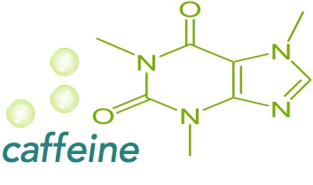

.. caffeine documentation master file, created by
   sphinx-quickstart on Thu Mar  6 18:27:57 2014.
   You can adapt this file completely to your liking, but it should at least
   contain the root `toctree` directive.

Welcome to the caffeine documentation!
=======================================

.. include:: what_is_caffeine.rst

If you're interested in how caffeine is the same or different from these other services, read :doc:`what_caffeine_is_for`.

Development status
===================

caffeine is bleeding-edge, alpha-quality software, that will require getting your hands dirty.  Python3 (on the server) and iOS/ObjC (on the client) are the only supported platforms for the forseeable future.

Contents:
=============

.. toctree::
   :maxdepth: 2

   what_caffeine_is_for
   architecture_overview
   install
   use
   urls
   security
   wireformat
   contributing

Class reference
==================

.. toctree::

   modules

Indexes and tables
==================

* :ref:`genindex`
* :ref:`modindex`
* :ref:`search`

